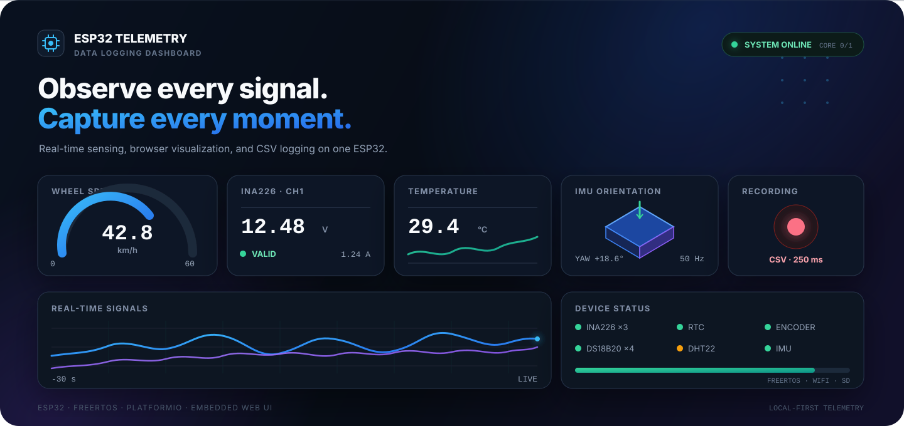
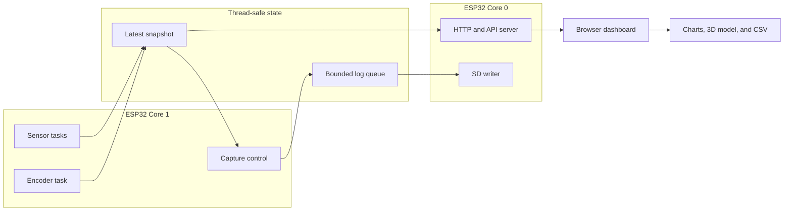

<div align="center">



# ESP32 Data Logging Dashboard

**A real-time sensor monitor and data logger for ESP32, built with FreeRTOS and an embedded web dashboard.**

[](https://www.espressif.com/en/products/socs/esp32)
[](https://www.arduino.cc/)
[](https://platformio.org/)
[](https://www.freertos.org/)

[Getting started](#getting-started) · [Hardware map](#hardware-map) · [Data logging](#data-logging) · [Hardware assets](hardware/README.md) · [Troubleshooting](docs/troubleshooting.md)

</div>

---

## Overview

This project turns an ESP32 into a compact telemetry hub for electrical, environmental, motion, and speed measurements. The firmware samples sensors in dedicated FreeRTOS tasks, publishes a responsive dashboard over the local Wi-Fi network, and records structured CSV data for later analysis in Excel or another data tool.

The dashboard is compiled into the firmware, so no separate filesystem upload is required. Live charts, controls, and the optional IMU orientation model run in the browser to keep the ESP32 workload predictable.

> [!IMPORTANT]
> This repository is an engineering prototype. Software checks are included, but measurement accuracy, electrical safety, and long-duration stability must still be validated on the target PCB.

## Project at a glance

| Capability | Implementation | Default |
|:--|:--|:--|
| Live monitoring | Embedded responsive web dashboard | Local Wi-Fi |
| Data capture | Browser CSV and optional SD card logging | 250 ms interval |
| Current sensing | Three independent INA226 channels | 1 mΩ shunt per channel |
| Temperature | One DHT22 and four DS18B20 inputs | Separate GPIO lines |
| Motion | MPU6050 or MPU6500 acceleration, roll, pitch, and yaw | Approx. 50 Hz |
| Speed | Quadrature encoder, shaft RPM, wheel RPM, and km/h | 360 P/R, 100 mm wheel |
| Output control | MCP23017 GA0–GA3 manual control and chase sequence | 2 Hz chase |
| Runtime | FreeRTOS tasks split across both ESP32 cores | Sensors on Core 1, web on Core 0 |

## Features

| Real-time telemetry | Reliable recording | Runtime control |
|:--|:--|:--|
| Voltage, current, power, temperature, orientation, RPM, and speed | Fixed-column CSV with validity and data-age fields | Enable or disable each sensor from the dashboard |
| Three INA226 gauges and four independent DS18B20 channels | Browser-side IndexedDB buffer and CSV download | Set logging interval from 100 ms to 60 s |
| Optional browser-rendered 3D IMU model capped at approximately 20 FPS | Optional FAT16/FAT32 SD card storage | Configure INA226 shunts, encoder geometry, and debug LED speed |
| Sensor status, stale-data detection, and health endpoints | Start and stop buttons create separate recording sessions | Control GA0–GA3 or run an adjustable chase pattern |

## System architecture



Each sensor task owns its device. I²C access is serialized with a mutex, while the web server reads a shared snapshot instead of polling hardware directly. The task watchdog remains enabled.

## Hardware map

The I²C bus uses **GPIO21 for SDA**, **GPIO22 for SCL**, and a default clock of **100 kHz**.

| Device | GPIO / address | Notes |
|:--|:--|:--|
| INA226 CH1 / CH2 / CH3 | `0x40` / `0x45` / `0x44` | Independent 1 mΩ defaults |
| MCP23017 | `0x27` | GA3 → GA2 → GA1 → GA0 chase order |
| MCP7940N RTC | `0x6F` | Oscillator and time must be initialized |
| MPU6050 / MPU6500 | `0x68` or `0x69` | Accepts WHO_AM_I `0x68` or `0x70` |
| DHT22 | GPIO4 | Pulse capture uses the ESP32 RMT peripheral |
| DS18B20 1 / 2 / 3 / 4 | GPIO27 / 16 / 13 / 14 | One sensor on each data line |
| Encoder A / B | GPIO32 / GPIO33 | 360 P/R, quadrature ×4 |
| SD CS / SCK / MISO / MOSI | GPIO5 / 18 / 19 / 23 | SPI, FAT16 or FAT32 |
| Record START / STOP | GPIO36 / GPIO39 | Active LOW, external pull-ups required |
| Debug LED | GPIO2 | Active HIGH; blinks only while recording |
| 12 V supply sense | GPIO15 | Disabled while Wi-Fi is active because GPIO15 uses ADC2 |

Each DS18B20 data line needs the pull-up used by the board design. The current firmware expects four separate GPIO lines; do not electrically join the four data pins.

## Getting started

### 1. Clone the repository

```powershell
git clone https://github.com/poommyroboticcamera-netizen/DATA-Logging-Dashboard-esp32.git
cd DATA-Logging-Dashboard-esp32
Copy-Item include/wifi_config.example.h include/wifi_config.h
```

On macOS or Linux, use:

```sh
cp include/wifi_config.example.h include/wifi_config.h
```

### 2. Configure Wi-Fi

Edit `include/wifi_config.h` and enter the credentials for a **2.4 GHz** network:

```cpp
constexpr const char *WIFI_SSID = "YOUR_WIFI_SSID";
constexpr const char *WIFI_PASSWORD = "YOUR_WIFI_PASSWORD";
constexpr bool SERIAL_IP_ONLY = true;
```

The local Wi-Fi file is excluded from Git, which prevents credentials from being committed accidentally.

### 3. Build and upload

Install PlatformIO CLI or the PlatformIO extension for VS Code, then run:

```sh
pio run -e esp32dev
pio run -e esp32dev -t upload
pio device monitor -b 115200
```

Close any other Serial Monitor before uploading. After a successful connection, the ESP32 prints a URL such as `http://192.168.1.50/`. Open that address from a device on the same network. Use `Ctrl+F5` after installing a new dashboard build.

No SD card is required to display the dashboard. The build script compresses the HTML, CSS, and JavaScript and embeds them directly in the firmware image.

### 4. Confirm the board controls

Review [`include/runtime_config.h`](include/runtime_config.h) before uploading. The current defaults assign START to GPIO36 and STOP to GPIO39. Both inputs are active LOW and require external pull-ups. An earlier schematic revision placed SW1 on GPIO34, so confirm the PCB revision and actual trace before relying on the labels.

## Data logging

1. Power the board and open the dashboard. Live readings appear without starting a recording.
2. Enable the sensors that should be included.
3. Press START on the PCB or dashboard. The debug LED begins blinking and a new session is created.
4. Press STOP to close the session and turn off the debug LED. Live monitoring continues.

### Browser CSV

Keep one dashboard tab open while recording. Received samples are buffered in IndexedDB and can be downloaded as CSV. Browser capture depends on Wi-Fi delivery and browser scheduling; missed packets are not synthesized. Use one recording tab per ESP32 address and download important sessions before changing the board IP or browser profile.

### SD card

Set `ENABLE_SD_LOGGING = true` in `include/runtime_config.h` and enable SD from the dashboard. The card mounts when recording starts and files are created as `/logs/log_00001.csv`, `/logs/log_00002.csv`, and so on.

The ESP32 SD library used by this project requires **FAT16 or FAT32**. Large cards, including many 128 GB models, are commonly supplied as exFAT and must be repartitioned and formatted to FAT32 before use. Back up the card before formatting it.

The dashboard reports separate states for firmware support, card mounting, and successful writes. Check `sd_mounted`, `sd_status`, and `sd_written` rather than treating availability alone as proof that data reached the card.

## Timing and calibration

| Parameter | Range / default |
|:--|:--|
| Recording interval | 100–60,000 ms / **250 ms** |
| Debug LED full cycle | 40–2,000 ms / **100 ms** |
| GA chase frequency | 0.2–20 Hz / **2 Hz** |
| INA226 and RTC update | Approx. 500 ms |
| DHT22 update | Approx. 2.5 s |
| DS18B20 update | Approx. 1 s |
| IMU update | Approx. 50 Hz, ±8 g and ±1,000°/s |
| Encoder calculation | Approx. 100 ms |

A recording interval shorter than a sensor update period repeats the latest sample with its age and validity flags. Invalid readings remain empty in CSV instead of being replaced by zero.

The encoder defaults to 360 pulses per revolution, a 100 mm wheel diameter, and a 1:1 shaft ratio. Each INA226 channel defaults to a 1 mΩ shunt. Adjust these values to match the installed hardware.

### IMU orientation

Yaw is integrated around the board's Z axis after a short stationary calibration. Keep the board level and still for approximately four seconds after startup. Because the system has no magnetometer, yaw can drift over time and is not a compass heading. Roll and pitch use gravity and may be temporarily unavailable during strong vibration or linear acceleration.

The optional 3D orientation block is rendered in the browser using values already returned by the API. Turning it on does not add another sensor task or request stream on the ESP32.

## Repository structure

```text
.
├── src/                         ESP32 firmware and FreeRTOS tasks
├── include/                     Runtime configuration and Wi-Fi example
├── dashboard/                   Embedded HTML, CSS, JavaScript, and tests
├── scripts/                     Dashboard embedding and CSV verification
├── tests/firmware_csv/          Host-side CSV test harness
├── docs/                        Troubleshooting and documentation assets
└── hardware/
    ├── schematic/               Editable sources and PDF/SVG exports
    ├── pcb/                     Layout sources and manufacturing outputs
    └── 3d/                      CAD sources, STEP/STL exports, and previews
```

The hardware directories are prepared for future schematic, PCB, and 3D files. They currently contain documentation placeholders rather than production-approved design outputs.

## Validation

```sh
node dashboard/core.test.cjs
node dashboard/imu-model.test.cjs
node --check dashboard/app.js
python scripts/test_firmware_csv.py
pio run -e esp32dev
```

The host-side harness validates the 77-column CSV schema and parser behavior for disabled, stale, and invalid sensor values. These checks complement physical hardware tests; they do not replace calibration or endurance testing on the assembled board.

## Diagnostics

The firmware exposes `/api/health` and `/api/state` for runtime inspection. Serial output is intentionally compact and normally shows only the dashboard URL and abnormal reset information. For wiring, stale readings, SD mounting, and Wi-Fi issues, see the [troubleshooting guide](docs/troubleshooting.md).

## Security and project status

The web interface is intended for a trusted local network and does not implement authentication. Do not forward it directly to the public internet. Wi-Fi credentials, build output, and experiment recordings are excluded from version control.

No project license has been selected yet. Until a license is added, the repository remains publicly viewable but does not grant general permission to copy, modify, or redistribute the code. Third-party libraries remain subject to their own licenses.

---

<div align="center">

**Designed for observable, repeatable ESP32 hardware testing.**

[Dashboard details](dashboard/README.md) · [Hardware workspace](hardware/README.md) · [Report an issue](https://github.com/poommyroboticcamera-netizen/DATA-Logging-Dashboard-esp32/issues)

</div>
