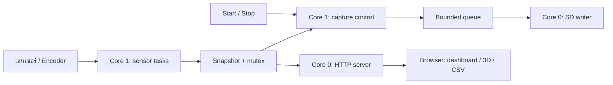

# ESP32 Data Logging Dashboard

**ระบบแสดงผลและบันทึกข้อมูลเซนเซอร์ผ่าน Wi-Fi สำหรับ ESP32**

FreeRTOS · Local web dashboard · CSV / SD logging · Browser-based IMU 3D

อ่านอุณหภูมิ แรงดัน กระแส ความเร่ง และ Encoder พร้อมหน้าเว็บฝังใน firmware เปิดจากคอมพิวเตอร์หรือโทรศัพท์ในเครือข่ายเดียวกัน งานวาดโมเดล 3D ประมวลผลบนเบราว์เซอร์

> **สถานะ:** โปรเจกต์สำหรับพัฒนาและทดสอบฮาร์ดแวร์ มีชุดทดสอบซอฟต์แวร์ แต่ความถูกต้องของการวัดและความเสถียรระยะยาวต้องตรวจบนบอร์ดจริง

[เริ่มใช้งาน](#quick-start) · [การต่อสาย](#hardware-map) · [ไฟล์ออกแบบ](hardware/README.md) · [แก้ปัญหา](docs/troubleshooting.md)

## Features

- INA226 ×3 พร้อมตั้ง Rshunt แยกช่อง
- DHT22 และ DS18B20 ×4 แบบแยก GPIO
- MCP7940N RTC และ MPU6050 / MPU6500 IMU
- Encoder quadrature แสดง RPM และความเร็วล้อ
- ปุ่มเริ่ม–หยุดบันทึก และไฟ Debug ที่ตั้งความเร็วแยกจากรอบบันทึก
- MCP23017: GA0–GA3 และไฟไล่ที่ตั้งความถี่ได้
- CSV สำหรับ Excel บน SD หรือเก็บข้อมูลที่รับผ่านเบราว์เซอร์
- โมเดลสี่เหลี่ยม 3D เปิด–ปิดได้ เริ่มต้นปิดเพื่อลดภาระหน้าเว็บ
- การตั้งค่าอุปกรณ์ รอบบันทึก Encoder, Rshunt และความเร็วไฟเก็บใน NVS

## Quick start

ติดตั้ง Git และ PlatformIO CLI หรือ PlatformIO IDE ใน VS Code

```powershell
git clone https://github.com/poommyroboticcamera-netizen/DATA-Logging-Dashboard-esp32.git
cd DATA-Logging-Dashboard-esp32
Copy-Item include/wifi_config.example.h include/wifi_config.h
```

แก้ `include/wifi_config.h` เป็นเครือข่าย **2.4 GHz** และรหัสผ่านของคุณ ไฟล์นี้ไม่ถูกส่งขึ้น Git

```cpp
constexpr const char *WIFI_SSID = "YOUR_WIFI_SSID";
constexpr const char *WIFI_PASSWORD = "YOUR_WIFI_PASSWORD";
constexpr bool SERIAL_IP_ONLY = true;
```

```sh
pio run -e esp32dev
pio run -e esp32dev -t upload
pio device monitor -b 115200
```

ปิด Serial Monitor อื่นก่อน Upload เมื่อเชื่อมต่อสำเร็จ Serial แสดง `http://<ESP32-IP>/` เปิดจากเครื่องในเครือข่ายเดียวกัน หลังอัปเดตเว็บให้กด `Ctrl+F5`

หน้าเว็บถูกบีบอัดและฝังอัตโนมัติระหว่าง build ไม่ต้อง Upload Filesystem และไม่ต้องมี SD เพื่อเปิด dashboard

### Board configuration

ตรวจ [include/runtime_config.h](include/runtime_config.h) ก่อน Upload: ปุ่มเริ่มปัจจุบัน **GPIO36**, ปุ่มหยุด **GPIO39**, active LOW และใช้ pull-up ภายนอก ส่วน Debug LED ใช้ GPIO2 active HIGH

**schematic รุ่นก่อนระบุ SW1 ที่ GPIO34 แต่ไฟล์ตั้งค่าปัจจุบันใช้ GPIO36** ต้องเทียบกับการต่อจริง ค่าที่เคยตั้งใน NVS มีผลเหนือค่าเริ่มต้นที่เกี่ยวข้อง

## Hardware map

I²C: **SDA = GPIO21, SCL = GPIO22**, 100 kHz

| อุปกรณ์ | ขา / Address | หมายเหตุ |
|---|---|---|
| INA226 CH1 / CH2 / CH3 | `0x40` / `0x45` / `0x44` | Rshunt เริ่มต้น 1 mΩ ต่อช่อง |
| MCP23017 | `0x27` | GA3 → GA2 → GA1 → GA0 |
| MCP7940N RTC | `0x6F` | ต้องตั้งเวลาและเริ่ม oscillator |
| MPU6050 / MPU6500 | `0x68` หรือ `0x69` | WHO_AM_I `0x68` / `0x70` |
| DHT22 | GPIO4 | RMT รับพัลส์ |
| DS18B20 · 1 / 2 / 3 / 4 | GPIO27 / 16 / 13 / 14 | DATA แยกหนึ่งตัวต่อขา |
| Encoder A / B | GPIO32 / GPIO33 | 360 P/R, quadrature ×4 |
| SD CS / SCK / MISO / MOSI | GPIO5 / 18 / 19 / 23 | SPI, FAT16/FAT32 |
| Supply sense | GPIO15 | ปิดอ่าน เพราะ ADC2 ใช้ร่วมกับ Wi-Fi |

DS18B20 ใช้ 3.3V, GND ร่วม และ pull-up ตามวงจร ห้ามรวม DATA ทั้งสี่ GPIO เข้าด้วยกันใน firmware รุ่นนี้

## Recording

1. เปิดเครื่อง: แสดงค่าปัจจุบัน แต่ยังไม่บันทึกและไฟ Debug ดับ
2. เปิดอุปกรณ์ที่ต้องการจาก dashboard แล้วกดปุ่มเริ่ม
3. กดปุ่มหยุด: หยุดเก็บ snapshot ใหม่และดับไฟ หน้าเว็บยังแสดงข้อมูลสด
4. กดเริ่มอีกครั้ง: แยกเป็นรอบใหม่

### Browser CSV

เปิดหน้าเว็บค้างไว้ระหว่างบันทึก ข้อมูลที่รับสำรองใน IndexedDB เมื่อหยุดจะมีไฟล์ให้ดาวน์โหลด เปิดดาวน์โหลดอัตโนมัติได้ตามสิทธิ์ของ browser

การเก็บขึ้นกับ Wi-Fi และ browser อาจพลาดช่วงข้อมูลเมื่อรอบสั้นหรือซ่อนแท็บ ไม่มีการเติมค่าที่ไม่ได้รับ ใช้ **หนึ่งแท็บบันทึกต่อ origin** เพื่อหลีกเลี่ยงข้อมูลชนกัน เปลี่ยน IP/browser จะเห็นที่เก็บคนละชุด ควรดาวน์โหลดข้อมูลสำคัญเก็บแยก

### SD card

ตั้ง `ENABLE_SD_LOGGING = true` และเปิด SD บน dashboard การ์ดเริ่ม mount เมื่อเริ่มบันทึก เก็บที่ `/logs/log_00001.csv` และเลขถัดไป งานที่เข้าคิวก่อนหยุดอาจเขียนต่อให้เสร็จ

- ต้องใช้ **FAT16/FAT32**; framework ปัจจุบันไม่รองรับ exFAT/NTFS
- การ์ด 128 GB มักเป็น exFAT ตรวจระบบไฟล์และสำรองข้อมูลก่อนฟอร์แมต
- `sd_available` คือความสามารถใน firmware ดู `sd_mounted`, `sd_status`, `sd_written` เพื่อยืนยันการเขียนจริง
- ถ้าไม่มีการ์ด ตั้ง `ENABLE_SD_LOGGING = false` เพื่อไม่เริ่มงาน SD

### Timing and units

| รายการ | ค่า / ช่วง |
|---|---|
| รอบบันทึก | 100–60000 ms, เริ่มต้น 250 ms |
| Debug LED | 40–2000 ms ต่อรอบติด–ดับ, เริ่มต้น 100 ms |
| GA chase | 0.2–20 Hz ต่อการเปลี่ยนขา, เริ่มต้น 2 Hz |
| INA / RTC | ประมาณ 500 ms |
| DHT22 / DS18B20 | ประมาณ 2.5 s / 1 s |
| IMU | ประมาณ 50 Hz, ±8g / ±1000°/s |
| Encoder | ประมาณ 100 ms |

GA 2 Hz = 500 ms ต่อขา = 2 s ครบสี่ขา เป็นไฟไล่ ไม่ใช่ PWM รอบบันทึกที่เร็วกว่าการวัดจะเก็บค่าล่าสุดซ้ำได้ มีอายุข้อมูลและ validity กำกับ ค่าที่ใช้ไม่ได้ถูกเว้นว่าง ไม่แทนด้วยศูนย์

Encoder เริ่มต้น 360 P/R, ล้อ 100 mm, อัตราทด 1; Rshunt 1 mΩ = 0.001 Ω ต้องปรับให้ตรงฮาร์ดแวร์จริง

## IMU visualization

Canvas 3D ใช้ข้อมูลเดิม ไม่มี request หรือ task อ่านเพิ่มบน ESP32 จำกัดประมาณ 20 FPS และปิดได้ ปุ่มมุมอ้างอิงเปลี่ยนเฉพาะภาพ ไม่เปลี่ยน CSV

Yaw เป็นมุมสะสมรอบแกน Z ของบอร์ด ต้องอยู่นิ่งประมาณ 4 s เพื่อคาลิเบรต อาจ drift ไม่ใช่เข็มทิศหรือทิศทางที่ชดเชยการเอียงครบทุกแกน Roll/Pitch อาศัยแรงโน้มถ่วงและอาจไม่พร้อมเมื่อสั่นแรง ภาพเป็นท่าทางโดยประมาณ ไม่ใช่ตำแหน่งเคลื่อนที่

## Architecture



แต่ละอุปกรณ์มี task เจ้าของ แบ่งปัน I²C ผ่าน mutex เว็บอ่าน snapshot แทนการอ่านเซนเซอร์โดยตรง และยังเปิด watchdog

## Repository layout

```text
src/main.cpp                Firmware / FreeRTOS tasks
include/                    Runtime config และตัวอย่าง Wi-Fi
dashboard/                  HTML / CSS / JS และโมเดล 3D
scripts/                    Embed dashboard / CSV verification
tests/firmware_csv/          Host test harness
docs/                       คู่มือแก้ปัญหา
hardware/schematic/         ต้นฉบับวงจรและ PDF exports
hardware/pcb/               Layout, Gerber, drill และ BOM
hardware/3d/                CAD, STEP/STL และภาพตัวอย่าง
```

โฟลเดอร์ hardware เตรียมไว้เพิ่มไฟล์ในอนาคต **ยังไม่มีชุดไฟล์ออกแบบหรือผลิตที่ยืนยันแล้ว**

## Validation

```sh
node dashboard/core.test.cjs
node dashboard/imu-model.test.cjs
node --check dashboard/app.js
python scripts/test_firmware_csv.py
pio run -e esp32dev
```

CSV harness ใช้ Python, Node.js และ g++/clang++ หรือ WSL ที่มี g++ บน Windows ตรวจ 77 คอลัมน์กับ parser จริง รวมข้อมูลปิด/เก่า/ผิดพลาด ไม่แทนการทดสอบเซนเซอร์และความเสถียรบนบอร์ด

## Project notes

- Serial แสดง URL และเหตุรีเซ็ตผิดปกติ ดู `/api/health` และ `/api/state` เพิ่มได้
- [รายละเอียด dashboard](dashboard/README.md) · [แก้ปัญหา](docs/troubleshooting.md)
- ออกแบบสำหรับเครือข่ายภายใน ไม่มี login ไม่ควรเปิดพอร์ตออกอินเทอร์เน็ต
- ไม่เก็บ Wi-Fi credentials, build output หรือบันทึกการทดลองใน Git
- ยังไม่ได้กำหนด license สำหรับโค้ดโปรเจกต์; dependencies ใช้เงื่อนไขของเจ้าของแต่ละรายการ
